# LedgerAIClient

LedgerAIClient 是一个基于 React Native 开发的智能记账助手移动端应用。它不仅提供了完善的传统记账功能，更内置了基于 LLM 的高级 AI Agent，能够通过自然语言交互完成复杂的财务管理任务。

<div align="center">
  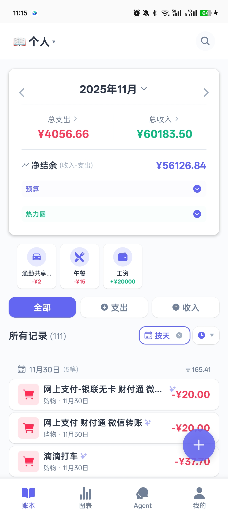
  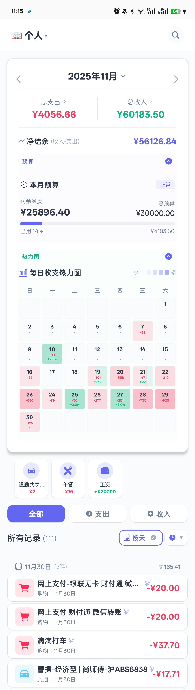
</div>

## ✨ 核心功能

### 1. 智能账本管理
- **多维展示**：支持按天、分类、账户、金额区间、创建人等多种维度分组查看账单。
- **高级筛选**：提供时间、金额、类型等多条件组合筛选。
- **灵活排序**：支持按时间、金额等字段的升降序排列。

<div align="center">
  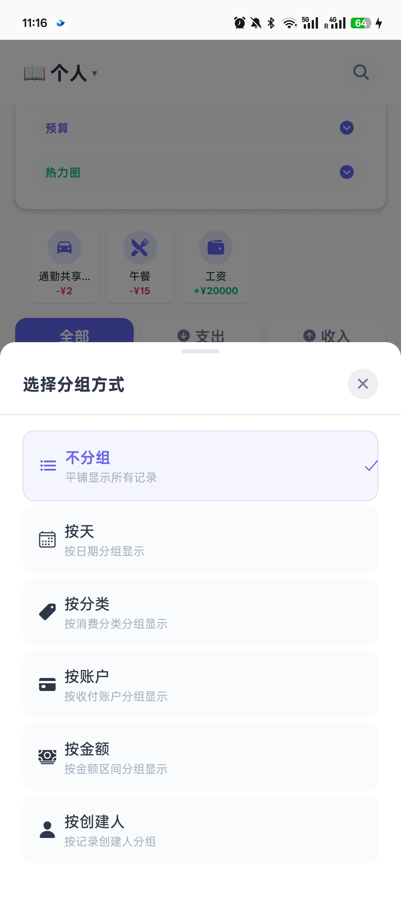
</div>

### 2. 数据报表与分析
- **可视化图表**：内置饼图、柱状图、折线图，直观展示收支构成与趋势。
- **多维分析**：支持从分类、趋势、维度（账户/账本）等不同视角深度分析财务状况。

<div align="center">
  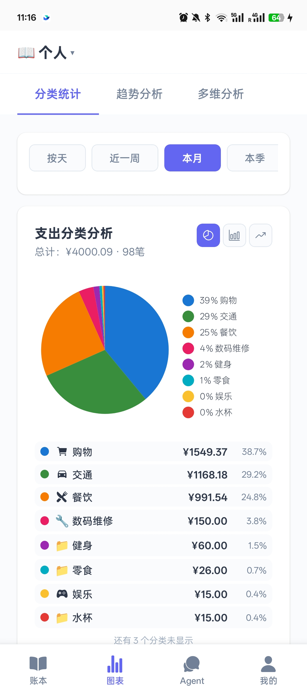
  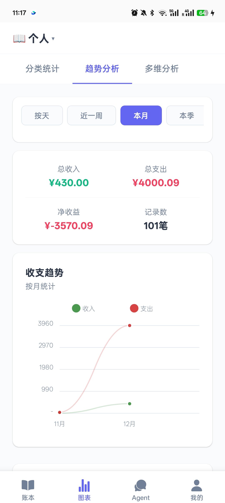
  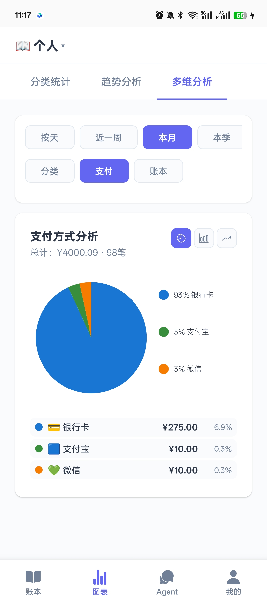
</div>

### 3. 协作与管理
- **多人记账**：支持生成邀请码邀请成员加入账本，设置不同权限（如编辑者）。
- **数据导出**：支持将交易记录、分类、支付方式等导出为 JSON、CSV、Excel 格式，便于二次分析。
- **个人中心**：完善的用户资料管理与账本切换功能。

<div align="center">
  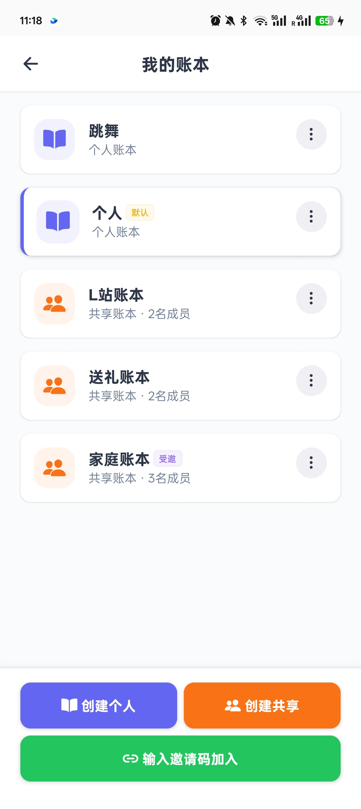
  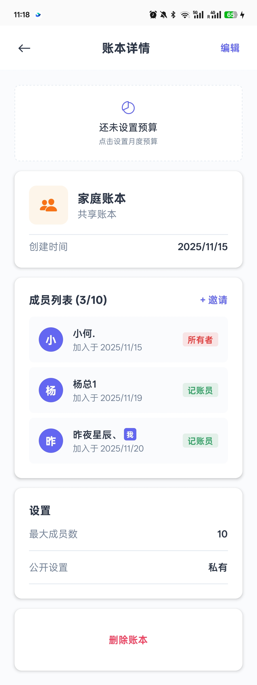
  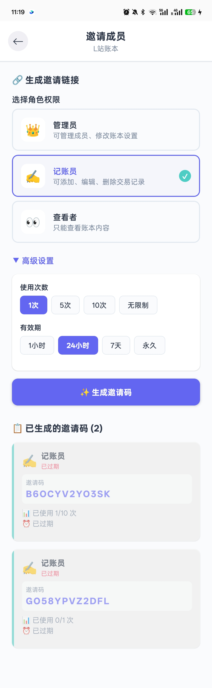
</div>

<div align="center">
  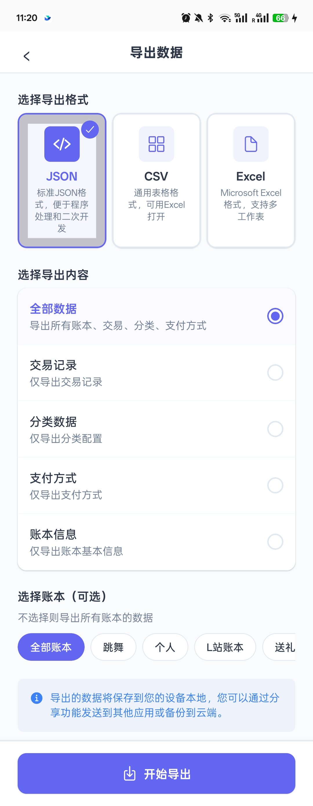
  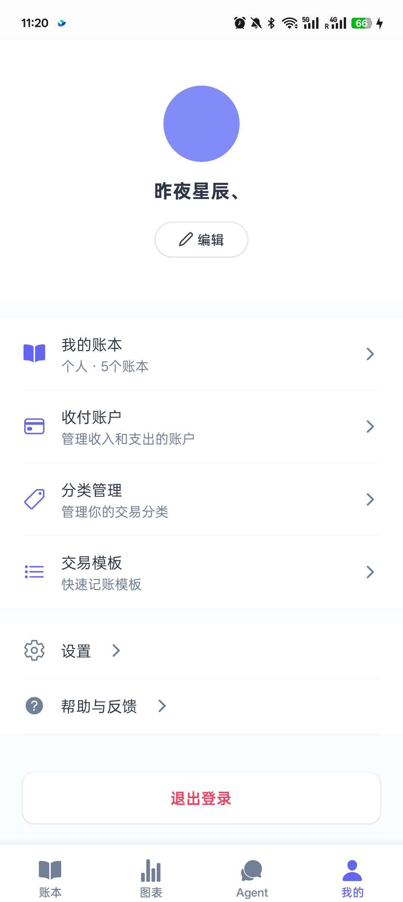
  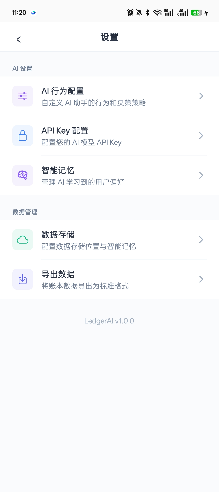
</div>

---

## 🤖 AI Agent 系统 (技术详解)

本项目内置了一个高度定制化的 **Stateful Agent**，区别于简单的聊天机器人，它是一个具备规划、执行、反思能力的自主智能体。

### 业务交互流程

从用户角度看，一次完整的交互流程如下：

<div align="center">
  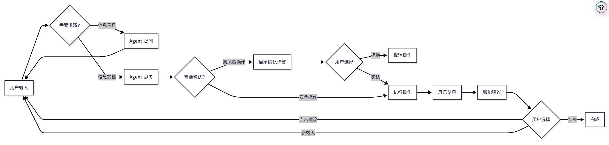
</div>


### 技术架构流程

底层技术实现细节，展示各 AI 组件如何协作：

<div align="center">
  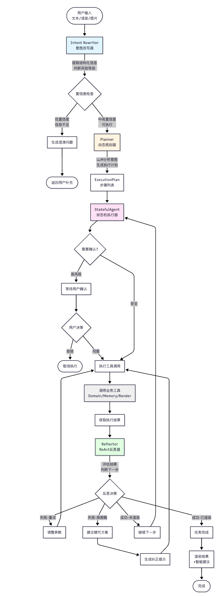
</div>


**流程说明**：

1. **Intent Rewriter（意图改写）**：预处理用户输入，提取结构化信息（金额、分类、日期等），判断操作风险。置信度低时主动询问用户补充信息。

2. **Planner（动态规划）**：由 LLM 分析用户意图，动态生成执行计划，将复杂任务拆解为可执行步骤。

3. **StatefulAgent（状态机执行）**：按计划逐步执行，高风险操作触发确认机制。

4. **Reflector（ReAct 反思）**：每步执行后评估结果，失败时自动寻找替代方案或调整策略，确保任务成功完成。

<div align="center">
  
  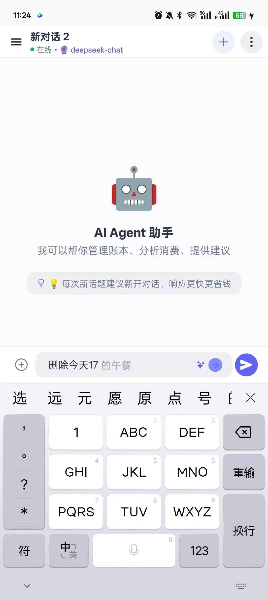
  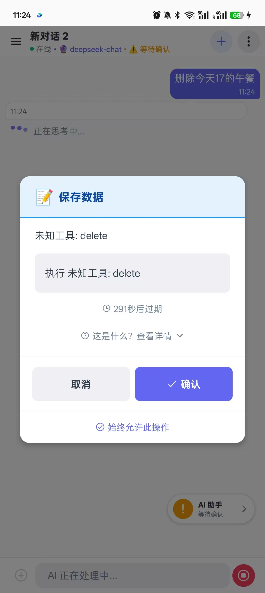
</div>

<div align="center">
  
  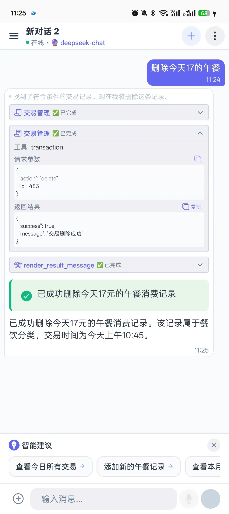
</div>

### 核心组件详解

**1. Intent Rewriter（意图改写器）**
- **结构化提取**：将口语化输入（如"帮我记一笔50块的午餐"）转换为结构化数据 `{amount: 50, type: "EXPENSE", category: "餐饮"}`
- **日期规范化**：自动将"上周"、"本月"等相对时间转换为精确的日期范围
- **风险评估**：自动识别操作风险等级（Low/Medium/High/Critical），高风险操作强制触发确认
- **置信度驱动**：信息不足时（置信度 < 0.4）主动询问用户，而非猜测执行

**2. Planner（动态规划器）**
- **LLM 驱动规划**：由 LLM 分析用户意图，生成结构化的 `ExecutionPlan`，无需硬编码模板
- **复杂任务拆解**：将"统计本月餐饮支出并生成图表"拆解为 [查询交易 → 计算总额 → 渲染图表] 等步骤
- **动态调整**：执行过程中可根据步骤结果动态调整后续计划（Re-planning）

**3. StatefulAgent（状态机执行器）**
- **状态管理**：精确控制 Thinking → Tool Call → Confirmation → Reflection 等状态流转
- **流式输出**：支持实时展示思考过程和执行进度
- **多模态支持**：处理文本、语音、图片（收据识别）等输入

**4. Reflector（ReAct 反思器）**
- **自我评估**：每步执行后，独立的反思模型评估结果是否符合预期
- **自动纠错**：工具调用失败时，生成修正建议（Correction Hint）指导下一步，例如："统计接口失败，改用查询接口获取数据后手动计算"
- **替代方案**：智能建议使用其他工具达成相同目标，确保任务最终完成

### 关键特性

-   **Context-Aware（上下文感知）**：运行时动态注入用户画像、当前账本状态、分类体系等上下文信息，确保 Agent "懂" 你的财务状况。
-   **Human-in-the-Loop（人机协同）**：对于敏感操作（如删除、大额修改），内置确认机制，确保安全。
-   **Extensible Tool System（扩展工具集）**：
    -   **Domain Tools**: 核心业务逻辑封装（账本、交易、分类管理）
    -   **Render Tools**: 控制客户端 UI 渲染，支持富文本与组件交互
    -   **Memory Tools**: 记忆用户偏好，实现个性化服务
    -   **Budget Tools**: 预算管理与提醒

<div align="center">
  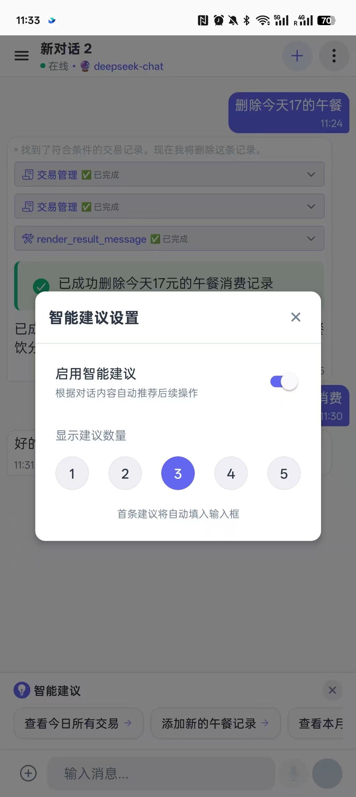
  
  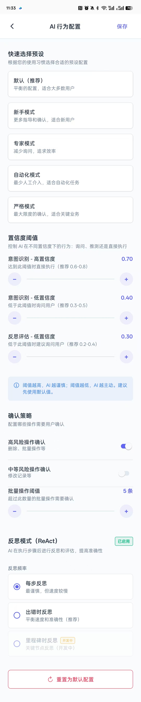
</div>

---

<div align="center">
  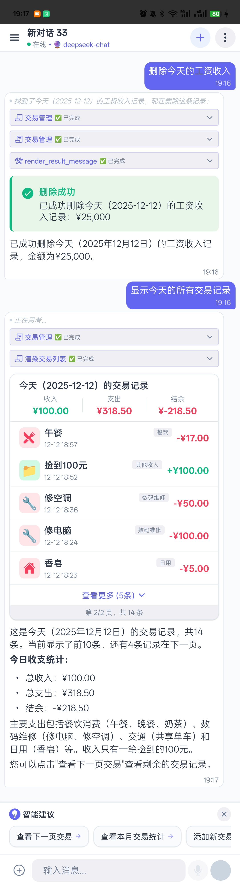
  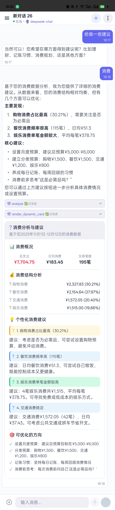
  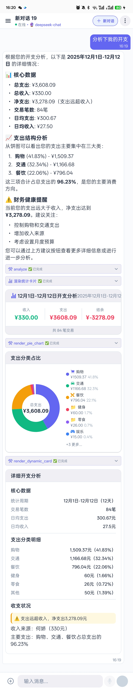
</div>

<div align="center">
  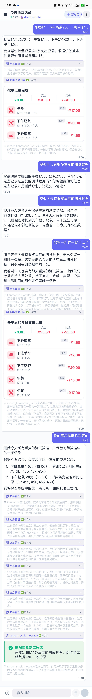
  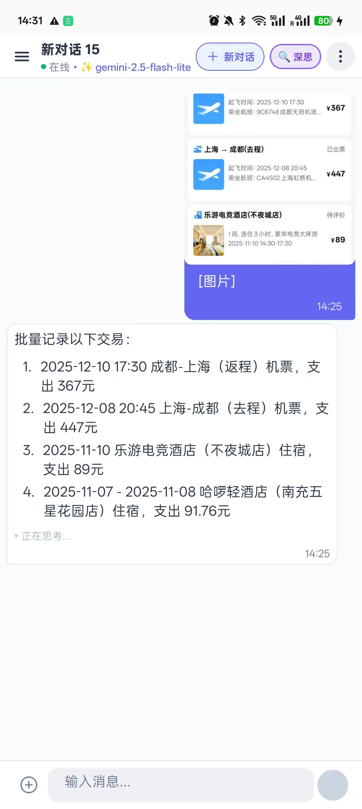
</div>
---

## 🛠 技术栈

-   **核心框架**: React Native 0.82+, TypeScript
-   **AI 框架**: LangChain.js (@langchain/core, @langchain/openai)
-   **导航**: React Navigation 7
-   **UI 组件**: React Native Reanimated, Vector Icons, SVG
-   **图表**: React Native Chart Kit
-   **网络**: Axios, StompJS (WebSocket)

## 🚀 快速开始

```bash
# 安装依赖
npm install

# iOS 运行
npm run ios

# Android 运行
npm run android
```

---

## 🔗 关联项目

-   **后端服务**: [Ledger Server](https://github.com/JamesSmith888/ledger-server) - 配套的智能记账后端服务 & MCP Server。
